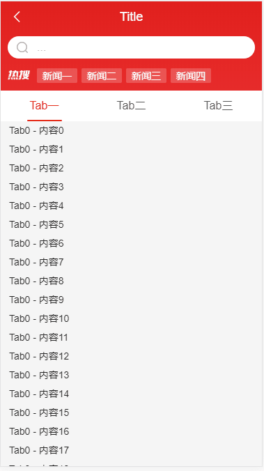

# Vue

## 1、scroll-tab组件——头部模块，纵向滚动跟随-横向切换固定
## 2、card-swpie组件——水平切换组件



## Project setup
```
npm install
```

### Compiles and hot-reloads for development
```
npm run serve
```

### Compiles and minifies for production
```
npm run build
```

### Customize configuration
See [Configuration Reference](https://cli.vuejs.org/config/).
